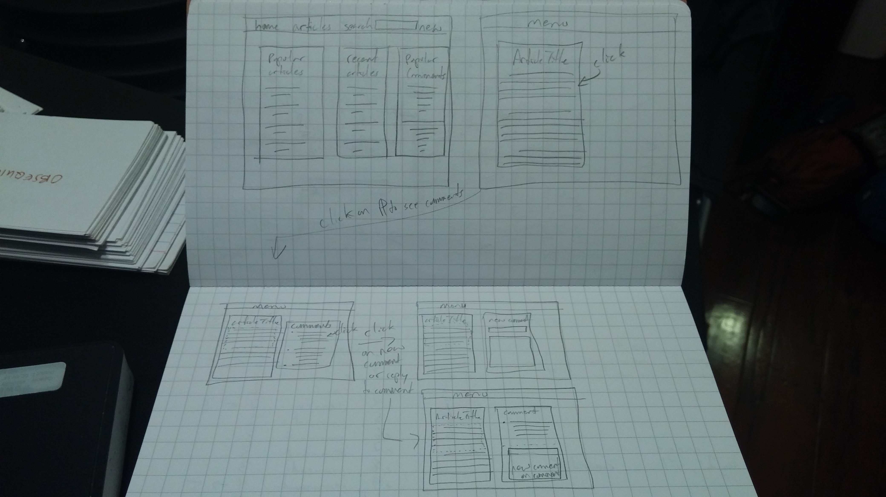

#Forum

is a platform to allow users to post plain text essays. Essays are made up of paragraphs which users can comment on. Essays can (and should!) link to external or internal content. Comments can (and should!) reference other paragraphs with an essay, or to other articles or comments. Making the paragraph, not the full essay, the commentable unit encourages conversations which are on topic and inclusive of source material. 

##User Stories
+ a user can submit a plain text essay
+ users can comment on paragraphs within an article
+ users can reference other paragraphs in an article and other content within the site (paragraphs in other articles, comments in the same, or other articles) when leaving comments
+ users have a to-read list
+ users can add articles to the to-read list
+ users can view lists of articles they've posted, articles they've referenced, articles they've commented on and their `@` mentions

##Future functionality
+ when posting an article, users can add tags
+ users can add tags to comments
+ users can mention other users with `@` inside a comment which will add their comment and the parent comment/article to another user's to-read list
+ users can highlight text from the article to get a link to a quote from a particular article or comment. The view associated with that link will be the full source with the selected quote highlighted in a bold color
+ Users will have a palette of recently viewed articles, comments, `@` mentions, and other site interactions which will enable them to conveniently add references to the comments and articles which they are writing

##Wireframes & ERD

##Routes
GET	
+ "/"	
.+ Index.ejs landing page with most up-to-date content
+ "/users/:user	"
.+ user.ejs account information, update photo url, etc, 
+ "/users/:user/toread	"
.+ todo.ejs view the to read list for the logged in user
+ "/history"
.+ history.ejs view the history for the user who is logged in
+ "/search	"
.+ Search.ejs search results page
+ "/:article	Article.ejs "
.+ view of an article
+ "/:article/:paragraph	"
.+ paragraphs.ejs view of a paragraph and any associated comments, sub-comments
	
POST	
+ "/users	"
.+ adds a user, redirect to /users/:user
+ "/articles	"
.+ adds articles, redirect to /:article
+ "/:article/paragraphs	"
.+ adds a comment to a paragraph
+ "/:article/:paragraph/:comment	"
.+ adds a comment to a comment on a paragraph
	
PUT	
+ "/users/:user	"
.+ edits a user, redirect to /users/:user
+ "/:article	"
.+ adds/edits a correction section to the top of an article that a user owns
+ "/:article/:paragraph	"
.+ adds/edits a correction section to a paragraph in an article that a user owns
+ "/:article/:paragraph/:comment"
.+ adds/edits a correction section to a comment that a user owns
	
DELETE	
+ No deleting

##Prioritization does not format well in MD

____DOITNOWGETTOTHECHOPPA_____________________

** denotes accomplished, unseen bold and italics indicate priority
times indicated are estimates

**tally comments by article and display on home page - 1hr
**optional order by comment number - 15 mins
implement upvote on articles - 2 hr

create pages
**	add article - 2hr
		create add article button on the navigation bar home page - 10 mins
**	create an enter comment modal - 45 mins
**	add user - 2hr
		add email to the database - 10 mins
	

article page 
**	create button to open/reveal the comments - 15 mins
**	button also hides the comments - 30 mins
**	style the by-line at the bottom of the page - 35 mins
	highlight the current selected paragraph - 45 mins

home page
**	float the search to the right (deprecated) - 10 mins
**	show popular articles based on # comments - 30 mins
	add an article image
**	style date - 10 mins

implement to-read list
	create a todo table w/user.id and article.id as a record - 4 hrs
	update the navbar menu to show saved articles - 40 mins

**create user landing pages with profile pictures, authored articles and to-read list - 2 hrs

comments partial
	add if statement which shows “no comments if there are no comments - 1.5 hrs

implement search and a search page - 4 hrs

implement sessions with cookies, 4 hrs
	add articles and comments as current user 4 hrs
